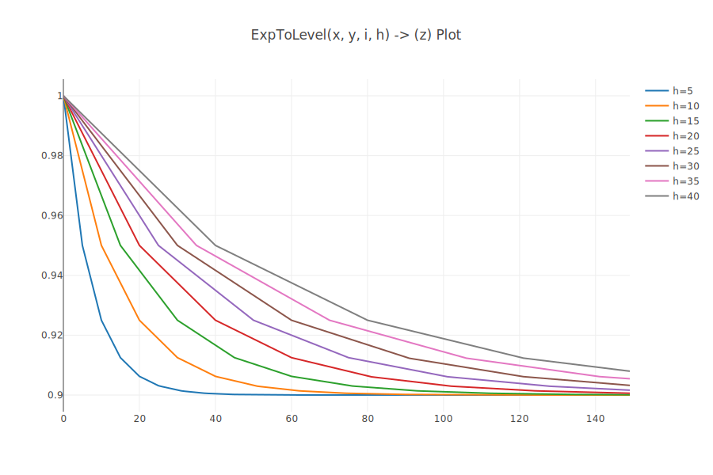

# 🖌️solplot
A Foundry plugin that enables you to plot charts within solidity.




&nbsp;
# Installation
First, make sure that you have [Rust installed](https://www.rust-lang.org/tools/install). Then install source as directed below.

<!-- &nbsp;
### Install from crates.io
```
cargo install solplot
``` -->

&nbsp;
### Installing binary from source
```
git clone https://github.com/0xClandestine/solplot &&
cd solplot &&
cargo install --path .
```

Then add `solplot` to your foundry project.

```
forge install 0xClandestine/solplot
```

Now simply inherit `Plot` into your test contract, and you'll have access to plotting methods.

```js
// SPDX-License-Identifier: UNLICENSED
pragma solidity ^0.8.13;

import "../src/Plot.sol";

contract DemoPlot is Plot {
    // Some math to plot out...
    function expToTarget(uint256 initialValue, uint256 targetValue, uint256 index, uint256 epochLength)
        internal
        pure
        returns (uint256 output)
    {
        output = initialValue >> (index / epochLength);
        output -= (output * (index % epochLength) / epochLength) >> 1;
        output += (initialValue - output) * targetValue / initialValue;
    }

    function testPlot_ExpToTarget() public {
        vm.removeFile("input.csv");

        // Create input csv
        for (uint256 i; i < 100; i++) {
            string[] memory cols = new string[](7);

            // Use first row as legend
            if (i == 0) {
                cols[0] = "x axis";
                cols[1] = "5 unit epoch";
                cols[2] = "10 unit epoch";
                cols[3] = "20 unit epoch";
                cols[4] = "30 unit epoch";
                cols[5] = "40 unit epoch";
                cols[6] = "50 unit epoch";
            } else {
                cols[0] = vm.toString(i * 1e18);
                cols[1] = vm.toString(expToTarget(1e18, 0.9e18, i, 5));
                cols[2] = vm.toString(expToTarget(1e18, 0.9e18, i, 10));
                cols[3] = vm.toString(expToTarget(1e18, 0.9e18, i, 20));
                cols[4] = vm.toString(expToTarget(1e18, 0.9e18, i, 30));
                cols[5] = vm.toString(expToTarget(1e18, 0.9e18, i, 40));
                cols[6] = vm.toString(expToTarget(1e18, 0.9e18, i, 50));
            }

            writeRowToCSV("input.csv", cols);
        }

        // Create output svg with values denominated in wad
        plot({inputCsv: "input.csv", outputSvg: "output.svg", inputDecimals: 18, totalColumns: 6, legend: true});
    }
}

```

&nbsp;
# Usage


```
Usage: solplot [OPTIONS] --input-file <INPUT_FILE> --output-file <OUTPUT_FILE> --decimals <DECIMALS> --columns <COLUMNS>

Options:
  -i, --input-file <INPUT_FILE>    
  -o, --output-file <OUTPUT_FILE>  
      --decimals <DECIMALS>        
      --columns <COLUMNS>
      --legend
  -h, --help                       Print help information
  -V, --version                    Print version information
```